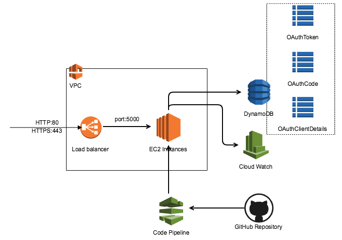
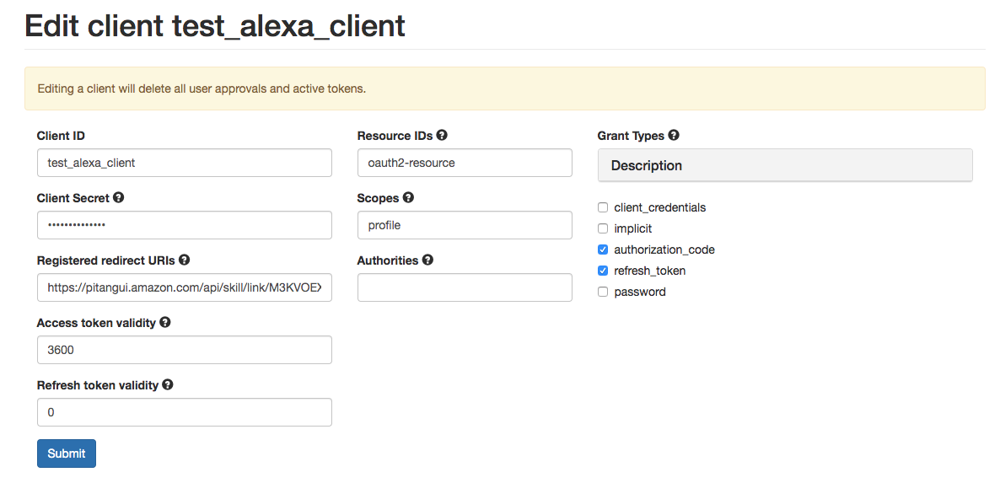
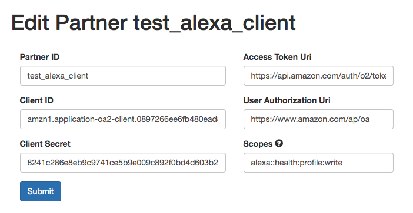
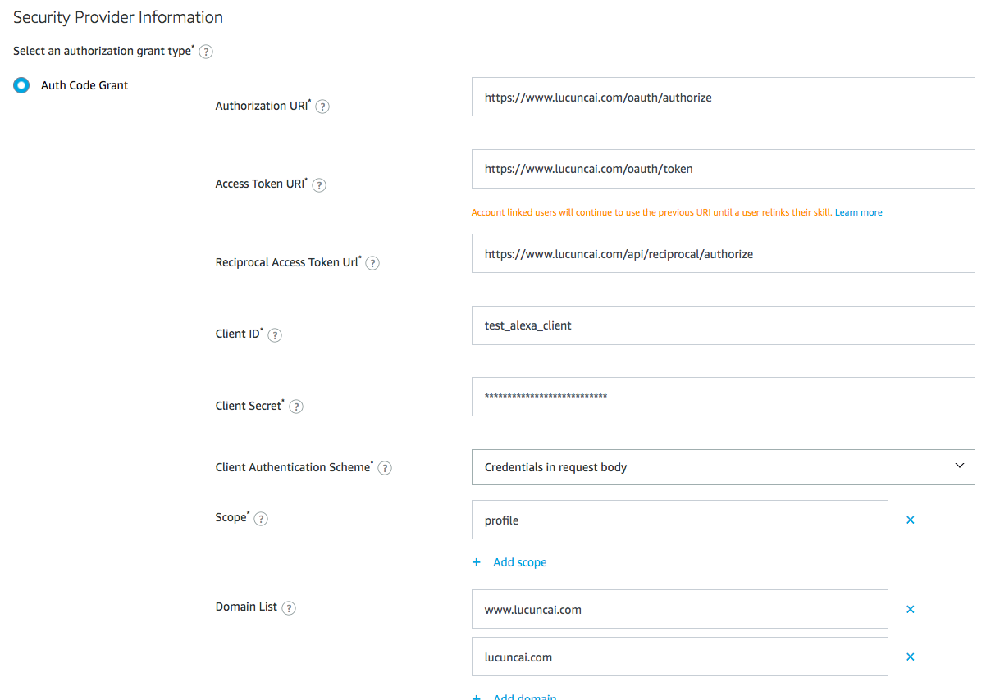

# Alexa OAuth Sample
Sample code to set up an OAuth 2.0 server for Skill developers. 
OAuth 2.0 server is required for Skill account linking, which lets you connect the identity of the user a different account systems.
Reciprocal authorization and client token management are also included to support mutual account linking can call Alexa APIs outside the Skill.

# Description
## Supported Grant Types
With the code sample and AWS cloud formation template, we provided a standard OAuth 2.0 service that supports the following five grant types
* [Authorization Code](https://oauth.net/2/grant-types/authorization-code/)
* [Implicit](https://oauth.net/2/grant-types/implicit/)
* [Password](https://oauth.net/2/grant-types/password/)
* [Client Credentials](https://oauth.net/2/grant-types/client-credentials/)
* [Refresh Token](https://oauth.net/2/grant-types/refresh-token/)

and an alexa specific grant type (for reciprocal account linking):
* [Alexa Reciprocal Authorization Code](https://developer.amazon.com/docs/account-linking/account-linking-for-health.html#get-your-tokens) *(Only required for mutual account linking)*

## Endpoints
* **/oauth/authorize**: The authorization endpoint is the endpoint on the authorization server where the resource owner logs in, and grants authorization to the client application.
* **/oauth/token**: The token endpoint is the endpoint on the authorization server where the client application exchanges the authorization code, client ID and client secret, for an access token.
* **/api/reciprocal/authorize**: The reciprocal authorization endpoint will be invoked by Alexa to send a LWA auth code. *(Only required for mutual account linking)*

## OAuth Management Portal
* **/login**: The portal used to administrator to manage OAuth Clients and Partners, as well as users to manage their approvals to other clients.

## Integrate with your authentication server
For testing purpose, a sample user **(user/password)** and a sample administrator **(admin/password)** are created for testing.

To integrate with your own authentication server or user DB, update the TODO task in ```AuthenticationServiceProvider``` class.

```java
public class AuthenticationServiceProvider {
    @Override
    public UserDetails loadUserByUsername(final String username) throws UsernameNotFoundException {
        //TODO: Integrate with your authentication system to return UserDetails.
    }
}
```

# Server Setup
To setup your own OAuth server,
1. Clone the repository from [alexa-oauth-sample](https://github.com/alexa/alexa-oauth-sample), modify the repository name if you want.
2.  with this [template](https://github.com/alexa/alexa-oauth-sample/blob/master/template.json)
3. Add your Domain Certificate and bind it to your load balancer (LB port: 443, Instance port: 80). *(HTTPS is required for Alexa Skill Account Linking.)*



# Integrate with Alexa Skill Account Linking
* [Understand Skill Account Linking](https://developer.amazon.com/docs/account-linking/understand-account-linking.html)

#### Create an OAuth client for Alexa
1. Login to [Alexa Skill console](https://developer.amazon.com/alexa/console/ask) and select your skill
2. Click **"PERMISSIONS"** section, write down your Client Id and Client Secret. 

3. Click **"ACCOUNT LINKING"** section, write done your Redirect URLs.

4. Login to [https://YOUR_DOMAIN/login]() as an administrator, Create a client that you vend to Alexa (e.g. alexa_skill_client)

4. (Only for mutual account linking) Login to [https://YOUR_DOMAIN/login]() as an administrator, create an OAuth partner to call Alexa APIs.
**IMPORTANT**: clientId and clientSecret here should be grabbed from your Alexa Skill (Under PERMISSION tab). The partnerId should be the same as the "clientId" in previous step.


#### Steps
1. Login to [Alexa Skill console](https://developer.amazon.com/alexa/console/ask) and select your skill
2. Click **"ACCOUNT LINKING"** section, fill the form with the following:

   * Authorization URI: [https://YOUR_DOMAIN/oauth/authorize]()
   * Access Token URI:  [https://YOUR_DOMAIN/oauth/token]()
   * Client ID: the clientId of the client you have created in the previous section.
   * Client Secret: the clientSecret of the client you have created in the previous section.
   * Client Authentication Scheme: Choose credentials in request body.
   * Scope: OAuth scopes to define the permissions. (This is used for your resource server, leave empty if you do not have one).
   * Domain List: YOUR DOMAIN (e.g. domain.com, www.domain.com)

# License
This library is licensed under the [Amazon Software License 1.0](LICENSE).